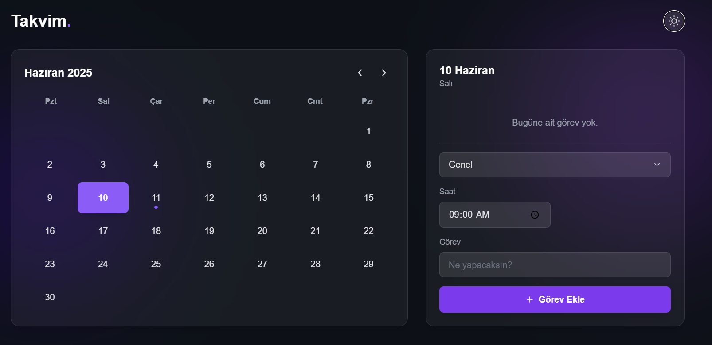
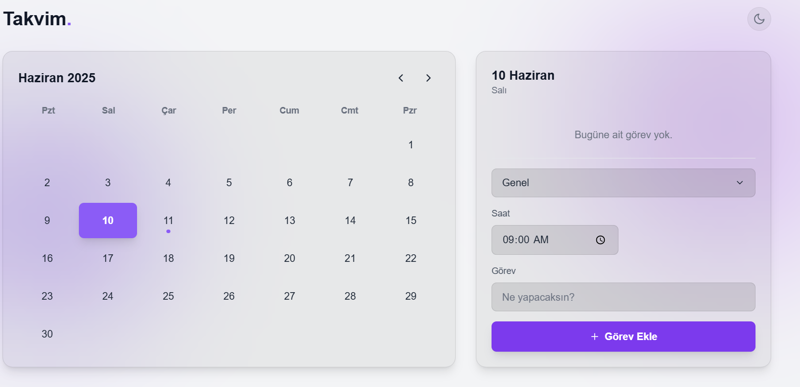
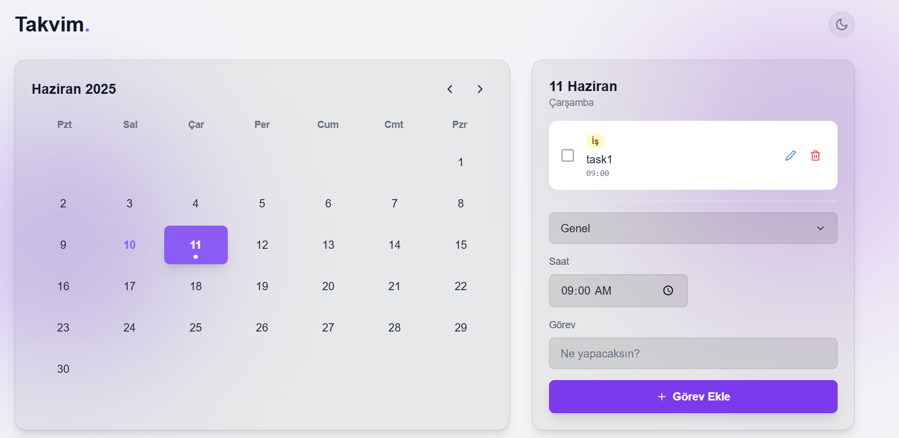

# Modern Calendar & Task Planner ✨

A sleek, modern, and fully-featured calendar and task management application built from the ground up with React and Tailwind CSS. Designed to provide a seamless and intuitive experience for managing daily, weekly, and monthly schedules.


---

## 📸 Screenshots

<p align="center">
  
     
  

  
</p>

---

## ✅ Features

- **📅 Interactive Calendar:** Easily navigate between months and select specific days.
- **📝 Full CRUD Functionality:** Create, Read, Update, and Delete tasks with a seamless UI.
- **✅ Task Completion:** Mark tasks as completed with a single click.
- **🌗 Light & Dark Mode:** A beautiful and consistent UI in both light and dark themes, with system preference detection.
- **💎 Glassmorphism UI:** A stunning, modern interface featuring a translucent, frosted-glass effect.
- **💾 Persistent Storage:** All tasks are saved to `localStorage`, so your data persists even after closing the browser.
- **📱 Responsive Design:** Looks and works great on both desktop and mobile devices.
- **Modern Dropdown:** A custom-built, stylish dropdown menu for category selection, replacing the native `<select>` element.
- **Custom Hooks:** Clean and reusable logic encapsulated in custom hooks like `useTasks` and `useTheme`.

---

## 🛠️ Tech Stack

- **React:** For building the user interface.
- **Vite:** For a blazing-fast development environment.
- **Tailwind CSS:** For rapid, utility-first styling.
- **React Icons:** For a clean and consistent set of icons.
- **PostCSS:** For transforming CSS with plugins like `autoprefixer`.
- **ESLint:** For maintaining code quality and consistency.

---

## 🚀 Getting Started

To get a local copy up and running, follow these simple steps.

### Prerequisites

- Node.js (v18.x or later)
- npm

### Installation & Setup

1.  **Clone the repository:**
    ```bash
    git clone https://github.com/havvakrbck1/calendar-app
    ```

2.  **Navigate to the project directory:**
    ```bash
    cd YOUR-REPO-NAME
    ```

3.  **Install NPM packages:**
    ```bash
    npm install
    ```

4.  **Run the development server:**
    ```bash
    npm run dev
    ```

The application will be available at `http://localhost:5173`.

---

This project was a fantastic learning journey in building a complete, modern web application.