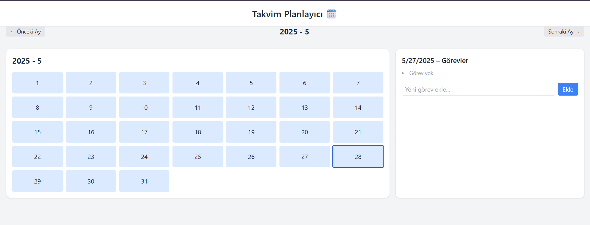
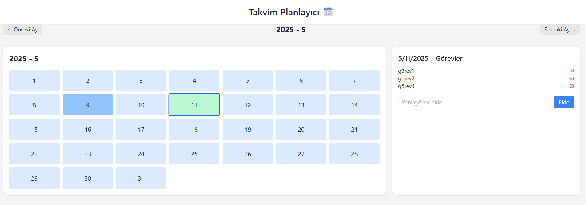

```markdown
# Calendar App

A web application to manage events and schedules.

## Features
- Event creation
- Monthly and weekly views
- Notifications

## Technologies Used
- JavaScript
- HTML
- CSS
## Ekran Görüntüleri




## Installation

```bash
git clone https://github.com/havvakrbck1/calendar-app.git
cd calendar-app
open index.html
